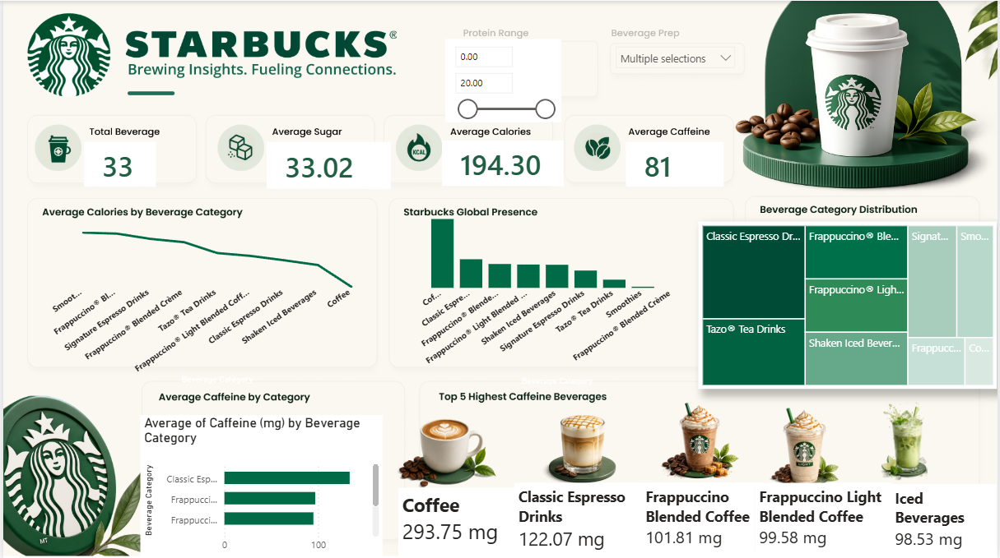

# Starbucks Power BI Dashboard

## 📊 Project Overview

This project is an interactive Starbucks sales analysis dashboard created using Microsoft Power BI.

The dashboard analyzes sales data to identify trends and patterns across product categories, beverage types, and sales performance.

## 🛠️ Tools & Technologies

- Microsoft Power BI
- Power Query
- DAX
- Data Visualization

## 📈 Dashboard

## 🔍 Key Analysis

The dashboard provides insights into:

## 🔍 Key Insights

* The dataset contains **33 beverages** with an overall average of **194.30 calories**, **33.02 g of sugar**, and **81 mg of caffeine**.
* **Coffee** has the highest average caffeine content at **293.75 mg**.
* **Classic Espresso Drinks** have the second-highest average caffeine content at **122.07 mg**.
* **Frappuccino Blended Coffee** averages **101.81 mg** of caffeine, followed by **Frappuccino Light Blended Coffee** at **99.58 mg**.
* **Iced Beverages** have an average caffeine content of **98.53 mg**.
* The dashboard provides a comparison of beverage categories based on calories, caffeine, and overall category distribution.

## 🎯 Objective

The objective of this project is to transform Starbucks sales data into an interactive dashboard that makes business trends and patterns easier to understand.

## 📁 Project Files

- `Starbucks analysis.pbix` — Power BI dashboard file
- `Starbucks_dashboard.png` — Dashboard preview
